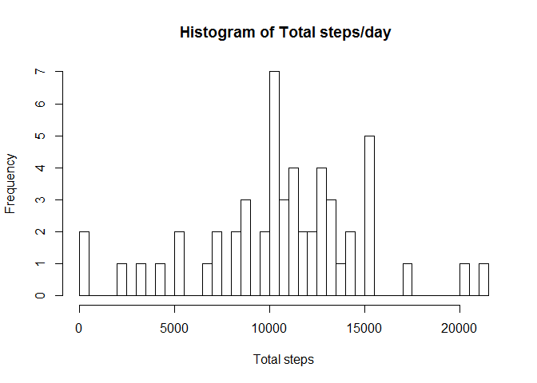
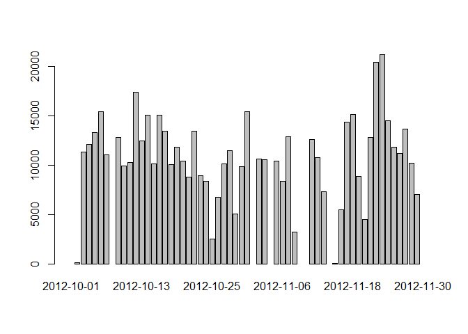
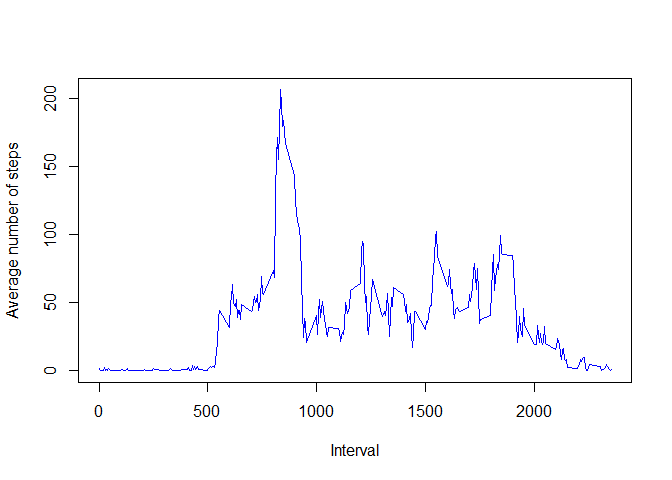
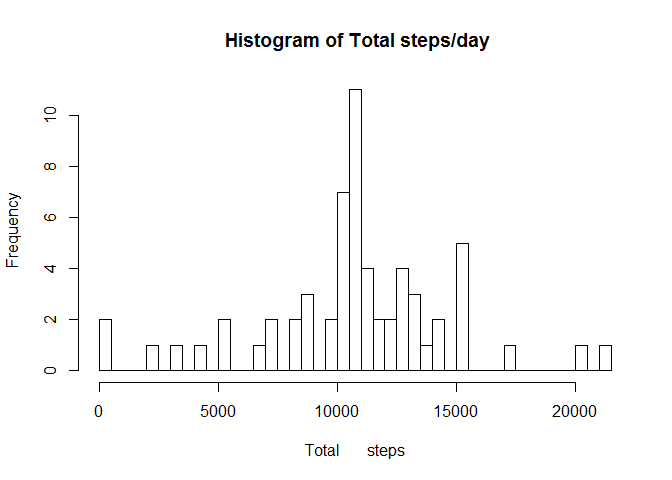
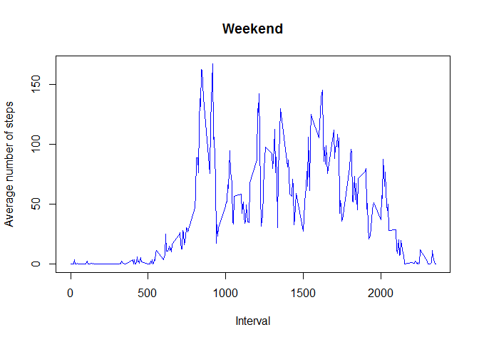
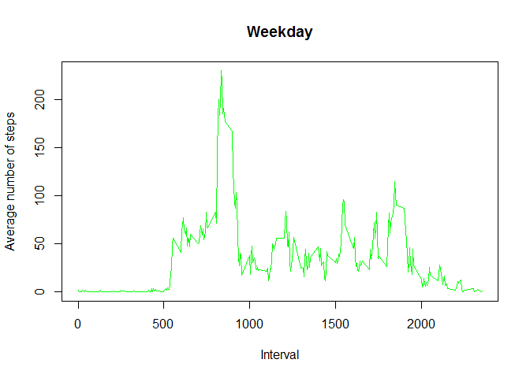

# Reproducible Research: Peer Assessment 1


## Loading and preprocessing the data
The first task in the analysis is to obtain the data. After reading the data the date field is formatted is the "Date"" format. This is done with the following code.  After reading the data summary statistics are displayed.

```r
act<-read.csv("./activity.csv")
act[,2]<-as.Date(act$date)
summary(act)
```

```
##      steps             date               interval     
##  Min.   :  0.00   Min.   :2012-10-01   Min.   :   0.0  
##  1st Qu.:  0.00   1st Qu.:2012-10-16   1st Qu.: 588.8  
##  Median :  0.00   Median :2012-10-31   Median :1177.5  
##  Mean   : 37.38   Mean   :2012-10-31   Mean   :1177.5  
##  3rd Qu.: 12.00   3rd Qu.:2012-11-15   3rd Qu.:1766.2  
##  Max.   :806.00   Max.   :2012-11-30   Max.   :2355.0  
##  NA's   :2304
```


## What is mean total number of steps taken per day?

To find the sum for each day I first bring in the plyr library and then use ddplyr grouped by date, calculating the sum for each date. Next a histogram of the total number of steps for each day is given. Personally, I think a barplot of sum by date is more descriptive so I added that also. 

```r
      library(plyr)
      ans<-ddply(act,~date, summarise, sum=sum(steps))
       hist(ans$sum, breaks=50, main=" Histogram of Total steps/day", xlab="Total steps")
```

 

```r
      barplot(ans$sum, names.arg=ans$date)
```

 

```r
      m<-mean(ans$sum, na.rm=TRUE)
      med<-median(ans$sum, na.rm=TRUE)
```
The mean of the total number of steps taken per day is 10766.18868. The median is 10765.

## What is the average daily activity pattern?
To create the time series plot for the average of the 5-minute intervals first

```r
      intAve<-ddply(act,~interval, summarise, mean=mean(steps, na.rm=TRUE))
      plot(intAve$interval, intAve$mean, xlab= "Interval", ylab= "Average number of steps", type='l', col='blue')
```

 

```r
      mx<-max(intAve$mean)
      I<-intAve[intAve$mean==mx,]
```

The average maximum number of steps is  206.1698113 which occcurs on the 835 interval.


## Imputing missing values


```r
miss<-is.na(act$steps)
s<-sum(miss)
```
There are 2304 missing values in the steps colmun.
Next the steps that have missing values will be modified by replacing each with the mean for the given time interval.


```r
##replace the NA values with the average for the given 5 min interval
      for(i in 1:length(act$steps))
            {  if(is.na(act$steps[i])){
                  j<-act$interval[i]
                  act$steps[i]<-intAve$mean[intAve$interval==j]
                  }        
            } 
#now create a histogram and calc the mean and median with the NA's filled in
      ans<-ddply(act,~date, summarise, sum=sum(steps))
       hist(ans$sum, breaks=50, main=" Histogram of Total steps/day", xlab="Total       steps")
```

 

```r
      m2<-mean(ans$sum)
      med2<-median(ans$sum)
```
Using the modified data set, the mean of the total number of steps taken per day is 10766.18868. The median is 10766.18868. Replacing the na values with the average for the given interval has had nearly no impact on the resulting mean and median.  This is probably because the NAs are ignored in the first calculations.  After replacing them with the the average, the impact on caluclating average will be minimal.   

## Are there differences in activity patterns between weekdays and weekends?
Now to separate the activity that occurs on weekdays versus weekends.


```r
      w<-weekdays(act$date)
      for(i in 1:length(w)){ 
            if(w[i]=="Saturday" | w[i]=="Sunday") 
                  w[i]<-"weekend" 
            else 
                  w[i]<-"weekday"
            }
      w<- as.factor(w)
      act<-cbind(act, w)
      we<-act[act$w=="weekend",]
      wd<-act[act$w=="weekday",]

weAve<-ddply(we,~interval, summarise, mean=mean(steps, na.rm=TRUE))
wdAve<-ddply(wd,~interval, summarise, mean=mean(steps, na.rm=TRUE))
#par(mfrow=c(2,1))

{
plot(weAve$interval, weAve$mean, xlab= "Interval", ylab= "Average number of steps", main="Weekend", type='l', col='blue')

plot(wdAve$interval, wdAve$mean, xlab= "Interval", ylab= "Average number of steps", main="Weekday", type='l', col='green')
}
```

  
